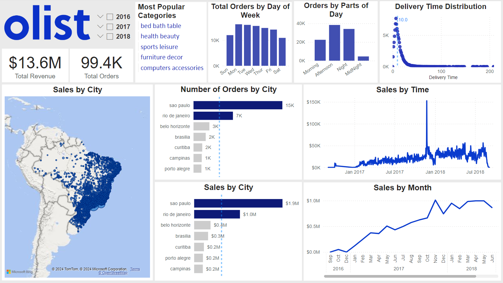
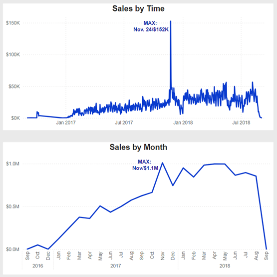
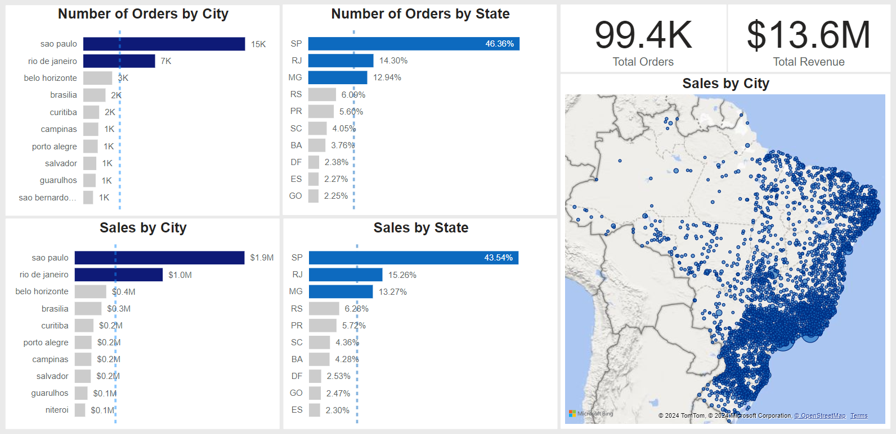

# Brazilian E-Commerce EDA
An exploratory data analysis to gain insights into e-commerce in Brazil.

*Power BI Dashboard*

SQL queries? Check them out here: [queries folder](/queries/)
# Project Description
This project leverages PostgreSQL and Power BI to analyze and gain insights into Brazil's e-commerce landscape. Using a real commercial dataset provided by Olist, Brazil's largest online department store, the analysis covers 100k orders from 2016-2018 across multiple marketplaces. The dataset includes detailed information on order status, price, payment, freight performance, customer location, product attributes, and customer reviews.

# Summary of Insights
### 1. Growing Trend 
Brazilian e-commerce experienced a growing trend from 2016 to 2018. The sharp decrease in September 2018 is likely due to incomplete data or noise. Revenue peaked at $152K on November 24, 2017, highlighting the significance of Black Friday.

### 2. Customer Behavior
Brazilians seem to prefer ordering online during weekday afternoons(12-18pm) and nights (18-24pm). Marketing and promotion plans can be made based on these characteristics.
### 3. Popular Categories
In terms of the number of purchases, bed, bath, table, health and beauty, sports and leisure, furniture and decor, and computers and accessories are the most popular categories.
### 4. Top Performing Regions
Most of the revenue comes from the southeast and south regions of Brazil, with the state of São Paulo contributing over 40% of the revenue and orders.

### 5. Delivery Time
The median delivery time is about 10 days, with quite a few delayed packages, with delivery times ranging from 100 to 200 days.

# Recommendations and Next Steps

### Optimize Promotion Timing:
Conduct further analysis to identify specific time periods and holidays with the highest likelihood of orders. Use these insights to plan targeted promotion campaigns.

### Improve Delivery Efficiency:
Investigate the reasons for delivery times exceeding a month. Consider switching carriers for regions with frequent delays and enhancing customer service to address delivery issues proactively.

### Expand Market Reach:
Analyze the common characteristics of top-performing cities. Identify regions with similar traits but lower revenue, and implement strategies to boost customer acquisition and order volumes in these areas.
